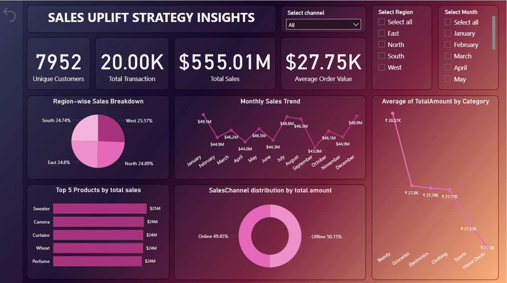

# 📊 Sales Uplift Strategy & Insights Dashboard

## 🧠 Purpose & Vision

This Power BI project was created to deliver **clear, insightful analytics on sales uplift strategies**. The report focuses on how sales evolved over time—before and after specific strategic initiatives—giving the business team a reliable way to **evaluate campaign effectiveness** and **optimize future planning**.

The project combines **data modeling**, **custom visuals**, and **SQL-based logic** to produce deep insights on regional performance, top products, category trends, and customer behavior.

---

## 🖼️ Dashboard Preview

> A high-level overview of KPIs, uplift analysis, and trend insights in an interactive Power BI report.

---

## 🗃️ What's Included?

### 📁 `Sales_uplift_strategy_insights.pbix`
- Interactive dashboard designed in **Power BI Desktop**
- Pages include:
  - Uplift % analysis (Before vs After strategy)
  - Regional performance heatmaps
  - Top-selling products & categories
  - Online vs Offline channel comparisons
  - Month-over-month growth visualizations
- Dynamic slicers for Region, Product, Date, and Channel
- Custom DAX measures for uplift %, category contribution, and YoY trends
- Bookmarks and tooltips for guided storytelling

### 🧾 `quries.sql`
- SQL scripts used for initial data aggregation and transformation before importing into Power BI
- Key queries include:
  - **Total Sales by Region** – aggregated over the last quarter  
  - **Top 5 Products** by revenue  
  - **Monthly Trends** – sales broken down by month and sales channel  
  - **Category Performance** – identifying rising/falling categories  
  - **Region Contribution** – each region’s percentage share of total sales  
  - **High-frequency Customers** – identifying loyal or repeat customers  

These queries were used either as raw data sources or for pre-processing insights that were modeled further in Power BI.

---

## ⏱️ Time & Effort Breakdown

| Phase                          | Description                                                                 | Time Spent |
|-------------------------------|-----------------------------------------------------------------------------|------------|
| 🔄 Data Ingestion & Cleaning   | Writing SQL queries, preparing clean datasets for import                   | 2 hours    |
| 🧮 Data Modeling & DAX         | Creating relationships, custom measures, calculated columns                | 3 hours    |
| 🧱 Report Structuring          | Designing visuals, layout themes, UX-friendly interactions                 | 3 hours    |
| ✅ Validation & Testing        | Verifying data accuracy, filter behavior, cross-checking SQL + visuals     | 1 hour     |
| 🗂️ Documentation & Final Touch | README creation, in-dashboard notes, query documentation                   | 1–2 hours  |

> **Total time invested: 10–12 hours**

---

## 🧩 Core Features

- 📊 **Uplift Analysis** – Strategy impact visualized via before/after KPIs  
- 🌍 **Regional Drilldowns** – Sales by region with percentage contributions  
- 🛍️ **Category & Product Trends** – Visual breakdowns of top performers  
- 🧠 **SQL-Driven Insights** – Seven meaningful queries supporting the foundation  
- 🔁 **Channel Comparison** – Online vs Offline monthly performance  
- 👥 **Customer Loyalty Tracking** – Identify repeat/high-value customers  
- 🎯 **Business Storytelling** – With interactive tooltips, bookmarks, and filters

---

## 📁 File Metadata

- **Filename 1:** `Sales_uplift_strategy_insights.pbix`  
- **Filename 2:** `quries.sql`  
- **Tool Used:** Power BI Desktop (latest version)  
- **Database Platform:** MySQL / SQL-compatible engine (based on syntax)  
- **Data Sources:** RetailTransactions (primary table used)  
- **Visual Theme:** Clean, business-friendly layout optimized for executive reviews  
- **Page Layout:** 16:9 widescreen

---

## 🛠️ How to Use the Project

### To View the Dashboard:
1. Open `Sales_uplift_strategy_insights.pbix` in Power BI Desktop  
2. Review the slicers and visuals across pages  
3. Use bookmarks/tooltips for storytelling guidance  
4. If needed, refresh data source paths

### To Run or Modify Queries:
1. Open `quries.sql` in any SQL editor (MySQL Workbench, DBeaver, etc.)  
2. Run queries against the **RetailTransactions** table  
3. Modify WHERE clauses for different timeframes or filters

---

## 🤝 Credits & Acknowledgments

Special thanks to:
- The business strategy team for defining key metrics and goals  
- Data engineers who helped structure the base data and provided validation support  
- Reviewers and stakeholders for iterative feedback during development

---